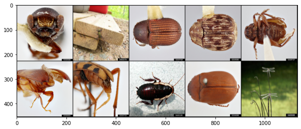
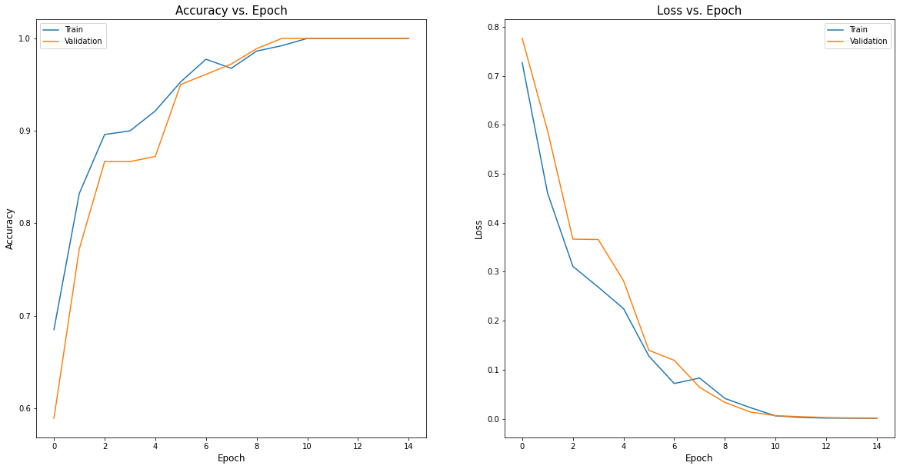
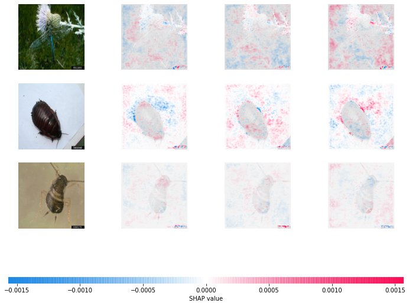

# Simple Convolutional Neural Network in PyTorch with SHAP

CNN (Convolutional Neural Network) has been at the forefront for image classification. Many state-of-the-art CNN architectures had been developed in the recent years to tackle the hardest computer vision problem, range from digit classification to real-time object detection. In addition, the applications of deep learning had always been controversial in many areas due to the lack of interpretability. Much effort have been devoted in the area of interpretable neural network, one of which utilizes the Shapley Additive Explanation (SHAP). This repository contains the creation of a simple CNN that can accurately classify 3 types of bugs (Beetle, cockroach and dragonfly), as well as the application of shapely value on the prediction outcome.

The figure below shows sample pictures of bugs collected from [InsectImages.org](https://www.insectimages.org/):

The CNN architecture contains the following elements:
- Convolution Layer (Kernel size: 5)
- Max Pooling Layer (Kernel size: 2)
- Batch Normalization Layer
- ReLU Activation
- Convolution Layer (Kernel size: 3)
- Max Pooling Layer (Kernel size: 2)
- Batch Normalization Layer
- ReLU Activation
- Fully Connected Layer (Input size: 46656; Ouput size: 120)
- ReLU Activation
- Fully Connected Layer (Input size: 120; Ouput size: 84)
- ReLU Activation
- Fully Connected Layer (Input size: 84; Ouput size: 3)

The model ran for 15 epochs and achieved an accuracy of 100%. The model Loss and Accuracy vs. Epochs are plotted below:

In an images, each pixel can be seen as a feature. Therefore, Shapley values in the context of machine leanring can be used to determine the pixel-level important in classifying images. This idea is illustrated in the image below:

## Blog Post

In addition, I have a Medium blog post that describes this project in detail. 

Topic | Post
-------|-----
CNN | [Simple Convolutional Neural Network with SHAP](https://michaeltang101.medium.com/simple-convolutional-neural-network-with-shap-4fc473472a6d)

